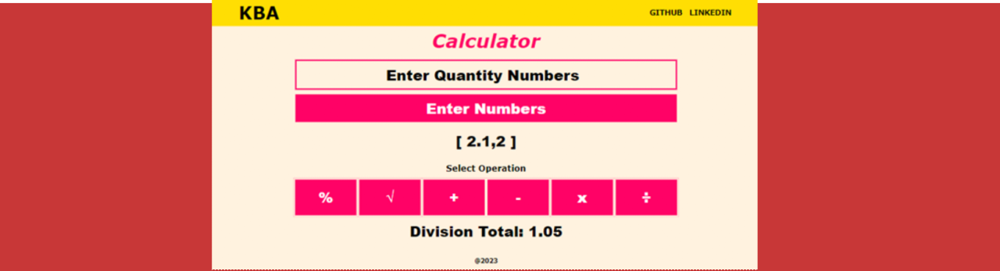

# **Simple Calculator**

## Sobre o projeto

Projeto: [trabalho de javascript](https://javascript-simple-calculator-lovat.vercel.app/)

Calculadora simples para cálculos básicos. O usuário informa a quantidade de números a calcular e depois escolhe uma operação a ser realizada. O número máximo de números é 10 para adição, subtração, multiplicação e divisão. Para cálculo percentual são 2 números e para raiz quadrada é apenas 1 número.

Simple calculator for basic calculations. The user informs the amount of numbers to calculate and then chooses an operation to perform. Maximum number of numbers is 10 for addition, subtraction, multiplication and division. For percentage calculation it is 2 numbers and for square root it is only 1 number.

## Layout web e mobile 

## Tecnologias Utilizadas

* HTML 5
* CSS 3
* Javascript
    * Uso de DOM (DOM Usage)
    * Classe (Class)
    * Funções (Functions)
    * Evento (Event)
        * Click

## Autor

#### **Katarine Albuquerque**

    
    &nbsp;
    

